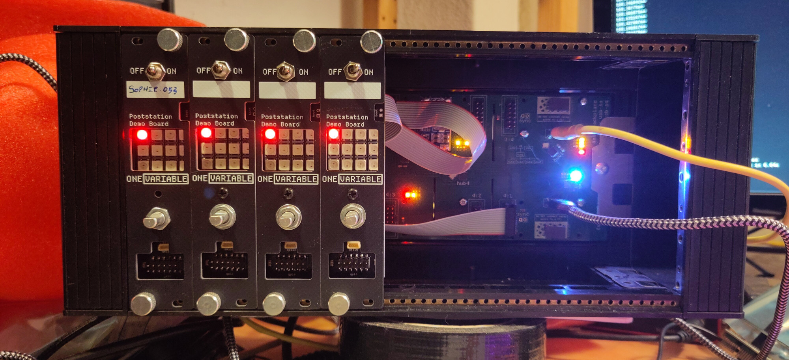
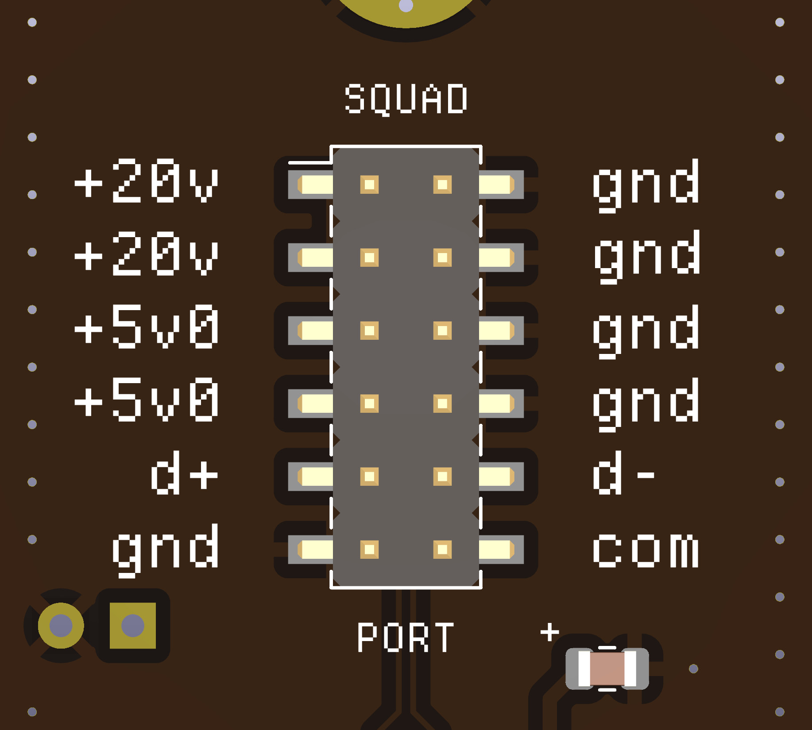

# BERLINER card/rack standard

BERLINER (BERLINER Euro Rack-Like Is Not Euro Rack) is an informal standard for USB and microcontroller oriented cards, using the eurorack form factor (but not the same power supply).

## The "standard"

Most of the "standard" here is the connector used on the boards. It's a 0.1" pitch 2x6 IDC connector. The picture above is taken looking at the BACK of the board.

The pins are:

| Use           | Pin   | Pin | Use             |
| :--           | :--   | --: | --:             |
| +20v power    | 1     |   2 |          Ground |
| +20v power    | 3     |   4 |          Ground |
| +5v0 power    | 5     |   6 |          Ground |
| +5v0 power    | 7     |   8 |          Ground |
| USB FS/HS D+  | 9     |  10 |    USB FS/HS D- |
| Ground        | 11    |  12 |          Common |

### "+20v power"

This is intended to be supplied by USB-PD, so it should be expected this rail can be any voltage 5v0 to 20v0 max. This rail is expected to have more wattage available than the +5v0 power rail. You may need a variable input DC/DC that can handle this.

### "+5v0 power"

This is a 5-volt-ish rail. Probably something in the tolerance of regular USB 5v, so +/- 0.25v. You can use this exclusively, but current may be shared with many other boards. If you need to do something high current, do it from the +20v power rail.

### "USB FS/HS D+/D-"

This is the normal differential pair used by USB Full Speed or USB High Speed.

### "Common"

This isn't super well defined, but it is intended as a low frequency, open-drain, interface, usable for clock sync or trigger. TBD who provides the pullup, maybe all boards on the order of 10k-50k (i.e. internal MCU pullups).

## `cards/` folder

These are board designs that are compatible with this "standard". They are intended to be mounted using the [Eurorack] device conventions, meaning a 128.5mm tall board, with M3 screws.

Some boards will have separate "face plates" or "covers" and "logic boards". In this case, the cover will be the full 128.5mm tall, and the logic board will often be a bit shorter (typ: 106.0mm), as it needs clearance to "drop into" the frame.

In these cases, covers will be mounted to the face plate either using hardware that is present (switches, dials), M3 headers, or some other mechanical means (outside the scope of this standard).

Feel free to open a PR with any designs you would like to share. KICAD designs preferred.

## `hubs/` folder

Since the cards don't take standard USB cables as input, it is generally necessary to have another PCBA that acts as an adapter. These have three main responsibilities:

1. Provide power to all boards, including the 20v0 rail and 5v0 rail
2. Provide data to all boards, often acting as a USB Hub
3. Provide 12-pin headers to connect to the cards, using an IDC ribbon cable

There are many options for chips that do this, but the CH334F (4 port USB hub) and CH224K (USB-PD negotiation) are used in some designs, and are available at reasonable prices.

Hubs can be present in two main forms:

1. As a "card", where the data and power ports face the front. See `hubs/usb-demo-4` for an example hub in this form factor.
2. As a "backplane", mounted somewhere inside the case, with connectors mounted somewhere on the case. See `hubs/backplane` for an example hub in this form factor, designed to fit the Sinusoda CAN eurorack case.

## License

idk something like cc-by-sa-nc?

